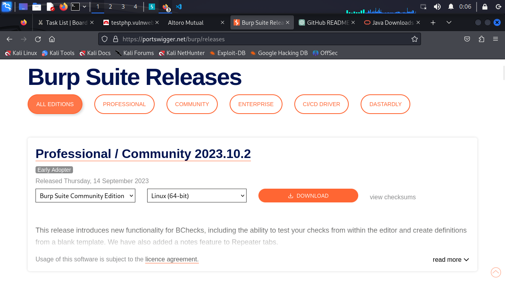

# Burp_Suite_lab_projects
The class-leading vulnerability scanning, penetration testing, and web app security platform. Learn with Practical

# What is Burpsuite 
Burp Suit is a Java application that can be used to secure or penetrate web applications. The Suite consists of different tools, such as a proxy server, a web spider, an intruder and a repeater.

# Burpsuite Alternatives: 
1. Acunetix
2. OWASP ZAP
3. Netsparker
4. W3af

# How to install Burp suite in windows 

offical website: [https://portswigger.net/burp], after signup 
There are Three options :-
1. Burp Suite Enterprise Edition
2. Burp Suite Professional
2. Burp Suite Community Edition

For Free go with community edition and download in your local system.
 
# Installation

First we need to install 
1. Java [https://www.oracle.com/uk/java/technologies/downloads/]
2. 

